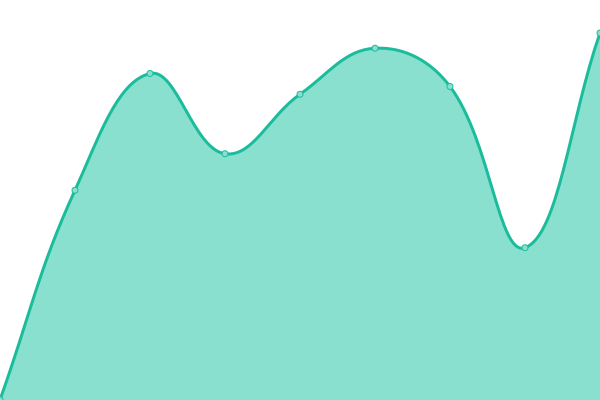

# [📈 Live Status](https://status2.students.cs.unibo.it): <!--live status--> **🟩 All systems operational**

This repository contains the open-source uptime monitor and status page for [Samuele Musiani](https://status2.students.cs.unibo.it), powered by [Upptime](https://github.com/upptime/upptime).

With [Upptime](https://upptime.js.org), you can get your own unlimited and free uptime monitor and status page, powered entirely by a GitHub repository. We use [Issues](https://github.com/samuelemusiani/status.adm/issues) as incident reports, [Actions](https://github.com/samuelemusiani/status.adm/actions) as uptime monitors, and [Pages](https://status2.students.cs.unibo.it) for the status page.

<!--start: status pages-->
<!-- This summary is generated by Upptime (https://github.com/upptime/upptime) -->
<!-- Do not edit this manually, your changes will be overwritten -->
<!-- prettier-ignore -->
| URL | Status | History | Response Time | Uptime |
| --- | ------ | ------- | ------------- | ------ |
|  [saragozza](saragozza.students.cs.unibo.it) | 🟩 Up | [saragozza.yml](https://github.com/samuelemusiani/status.adm/commits/HEAD/history/saragozza.yml) | 

 107ms
     
 | 

<a href="https://status2.students.cs.unibo.it/history/saragozza">100.00%</a>
    

|  [Adm website](https://students.cs.unibo.it) | 🟩 Up | [adm-website.yml](https://github.com/samuelemusiani/status.adm/commits/HEAD/history/adm-website.yml) | 

 897ms
     
 | 

<a href="https://status2.students.cs.unibo.it/history/adm-website">100.00%</a>
    

|  [Git](https://git.students.cs.unibo.it) | 🟩 Up | [git.yml](https://github.com/samuelemusiani/status.adm/commits/HEAD/history/git.yml) | 

 1011ms
     
 | 

<a href="https://status2.students.cs.unibo.it/history/git">100.00%</a>
    

|  [LDAP website](https://ldap.students.cs.unibo.it) | 🟩 Up | [ldap-website.yml](https://github.com/samuelemusiani/status.adm/commits/HEAD/history/ldap-website.yml) | 

 1118ms
     
 | 

<a href="https://status2.students.cs.unibo.it/history/ldap-website">100.00%</a>
    

|  [Netbox](https://netbox.students.cs.unibo.it) | 🟩 Up | [netbox.yml](https://github.com/samuelemusiani/status.adm/commits/HEAD/history/netbox.yml) | 

 963ms
     
 | 

<a href="https://status2.students.cs.unibo.it/history/netbox">100.00%</a>
    

|  [Semaphore](https://ansible.students.cs.unibo.it) | 🟩 Up | [semaphore.yml](https://github.com/samuelemusiani/status.adm/commits/HEAD/history/semaphore.yml) | 

 1045ms
     
 | 

<a href="https://status2.students.cs.unibo.it/history/semaphore">100.00%</a>
    

|  [Dynamik](https://risorse.students.cs.unibo.it) | 🟩 Up | [dynamik.yml](https://github.com/samuelemusiani/status.adm/commits/HEAD/history/dynamik.yml) | 

 735ms
     
 | 

<a href="https://status2.students.cs.unibo.it/history/dynamik">100.00%</a>
    

|  [CSUnibo website](https://csunibo.students.cs.unibo.it) | 🟩 Up | [cs-unibo-website.yml](https://github.com/samuelemusiani/status.adm/commits/HEAD/history/cs-unibo-website.yml) | 

 1251ms
     
 | 

<a href="https://status2.students.cs.unibo.it/history/cs-unibo-website">100.00%</a>
    

|  [Calendar website](https://calendar.students.cs.unibo.it) | 🟩 Up | [calendar-website.yml](https://github.com/samuelemusiani/status.adm/commits/HEAD/history/calendar-website.yml) | 

 729ms
     
 | 

<a href="https://status2.students.cs.unibo.it/history/calendar-website">100.00%</a>
    

|  [Media](https://media.students.cs.unibo.it) | 🟩 Up | [media.yml](https://github.com/samuelemusiani/status.adm/commits/HEAD/history/media.yml) | 

 690ms
     
 | 

<a href="https://status2.students.cs.unibo.it/history/media">100.00%</a>
    

|  [Registrate](https://registrate.students.cs.unibo.it) | 🟩 Up | [registrate.yml](https://github.com/samuelemusiani/status.adm/commits/HEAD/history/registrate.yml) | 

 762ms
     
 | 

<a href="https://status2.students.cs.unibo.it/history/registrate">100.00%</a>
    

|  [Dumbo](https://dumbo.students.cs.unibo.it) | 🟩 Up | [dumbo.yml](https://github.com/samuelemusiani/status.adm/commits/HEAD/history/dumbo.yml) | 

 737ms
     
 | 

<a href="https://status2.students.cs.unibo.it/history/dumbo">100.00%</a>
    

|  [VMID](https://vm.students.cs.unibo.it) | 🟩 Up | [vmid.yml](https://github.com/samuelemusiani/status.adm/commits/HEAD/history/vmid.yml) | 

 634ms
     
 | 

<a href="https://status2.students.cs.unibo.it/history/vmid">100.00%</a>
    

|  [Fileseeker](https://dav.students.cs.unibo.it) | 🟩 Up | [fileseeker.yml](https://github.com/samuelemusiani/status.adm/commits/HEAD/history/fileseeker.yml) | 

 2459ms
     
 | 

<a href="https://status2.students.cs.unibo.it/history/fileseeker">0.00%</a>
    

|  [Underleaf](https://underleaf.students.cs.unibo.it) | 🟩 Up | [underleaf.yml](https://github.com/samuelemusiani/status.adm/commits/HEAD/history/underleaf.yml) | 

 805ms
     
 | 

<a href="https://status2.students.cs.unibo.it/history/underleaf">100.00%</a>
    

<!--end: status pages-->

[**Visit our status website →**](https://status2.students.cs.unibo.it)

## 📄 License

- Powered by: [Upptime](https://github.com/upptime/upptime)
- Code: [MIT](./LICENSE) © [Anand Chowdhary](https://anandchowdhary.com), supported by [Pabio](https://pabio.com)
- Data in the `./history` directory: [Open Database License](https://opendatacommons.org/licenses/odbl/1-0/)
